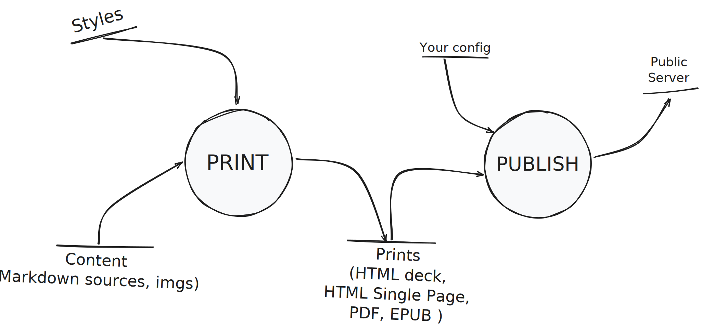

# Support de présentation démo

Une *dummy demo*, présentant le kit d'édition, d'impression et de publication de supports de présentation au format Markdown.

## Design

- **Une source de vérité** : les sources Markdown ;
- **Séparation contenu et mise en forme** : feuilles de style CSS dédiées ;
- **Print** : imprime les documents dans les différents formats ;
- **Publish** : distribue les documents sur un serveur (FTP par défaut) ;

## Workflow

[Consulter le README](https://github.com/paul-schuhm/kit-presentation-impression-publication?tab=readme-ov-file#usage-workflow)

## Background images

> [Voir toutes les options](https://marpit.marp.app/image-syntax)

## Mathématiques

$$
\vec{F} = m\,\vec{a}
$$

$$
i\hbar\,\frac{\partial}{\partial t}\,\Psi(\mathbf{r},t)
= \left[-\frac{\hbar^{2}}{2m}\nabla^{2} + V(\mathbf{r},t)\right]\Psi(\mathbf{r},t)
$$

